# ☁️ Cloud Drive

A full-stack **Cloud Storage and File Sharing Platform** inspired by modern cloud-drive applications.

Cloud Drive provides secure file and folder management, drag-and-drop uploads, file previews, project workspaces, cloud-native document editors, sharing with role-based permissions, AI-powered file analysis using Gemini, storage analytics, search, starred/recent files, and trash management.

The project was developed as part of my **Web Development Internship at Labmentix**, with a focus on building a practical, production-deployed full-stack application.

---

## 🌐 Live Application

### [Open Cloud Drive](https://cloud-drive-frontend-6t31.onrender.com)

> The application is deployed using Render with a separately deployed frontend and backend.

---

## 🖥️ Application Preview

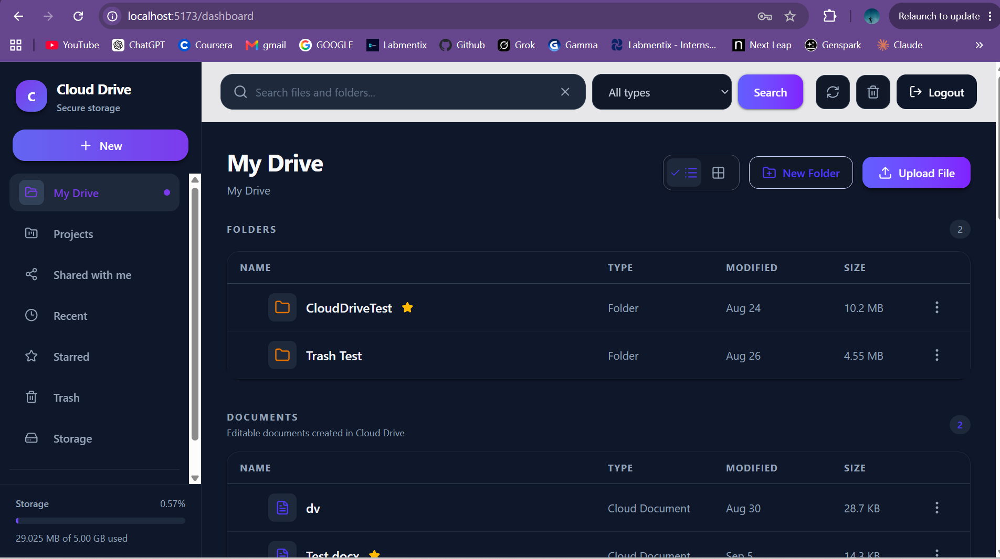

---

## ✨ Key Features

### 🔐 Authentication

- User registration and login
- JWT-based authentication
- Protected application routes
- User-specific files and folders
- Secure backend API access

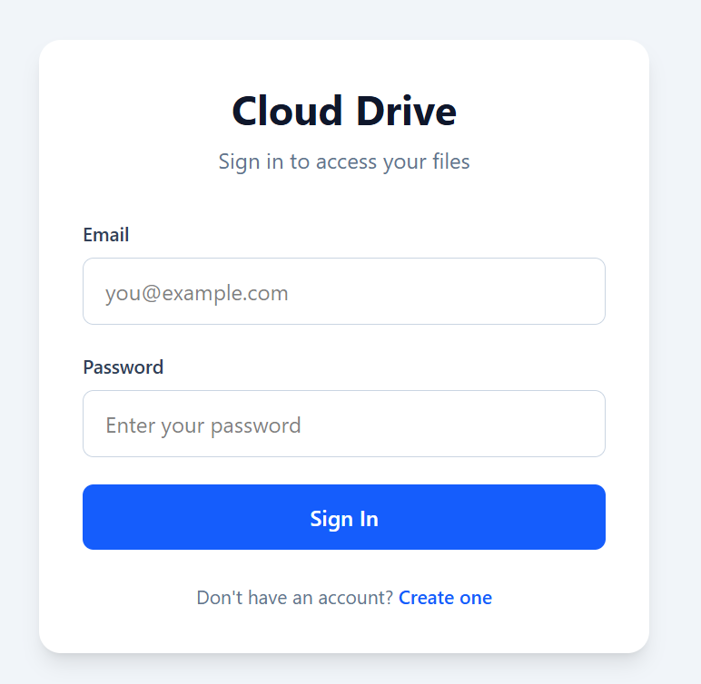

---

### 📁 File & Folder Management

Cloud Drive provides a complete file-management workflow.

Users can:

- Upload files
- Upload complete folders
- Create folders
- Create nested folder structures
- Rename files and folders
- Move files and folders
- Delete items
- Restore deleted items
- Permanently delete items
- Download files
- Copy file links
- Star important items
- View recent files
- Search files and folders
- Switch between grid and list layouts

The application also calculates folder sizes recursively.


---

## 🖱️ Drag & Drop

Cloud Drive includes advanced drag-and-drop support for both external and internal items.

### External Drag & Drop

Files can be dragged directly from the computer into Cloud Drive.

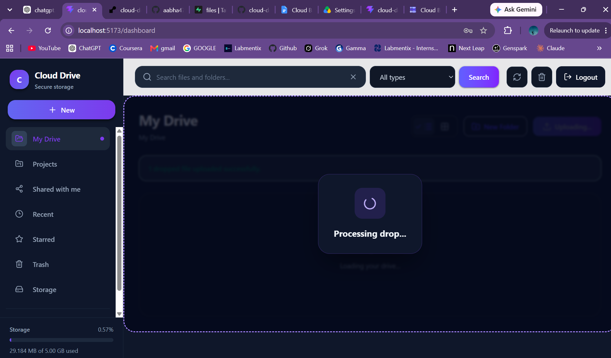

After processing, the uploaded file immediately becomes available in the Drive.

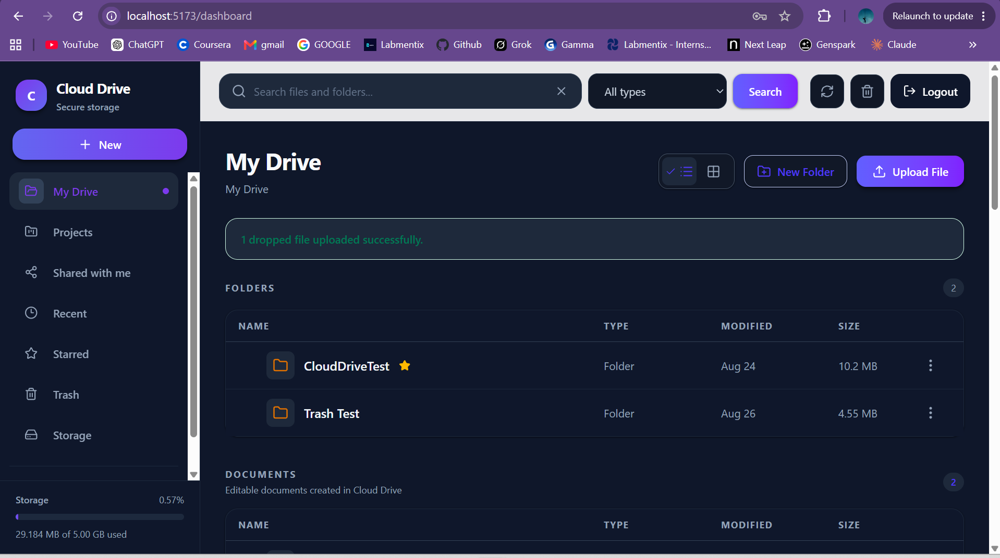

### Internal Drag & Drop

Existing Cloud Drive items can also be dragged between supported locations and folders.

Drag-and-drop behavior is supported across major application areas including:

- My Drive
- Projects
- Project folders
- Shared folders with Editor permission
- Recent
- Starred
- Storage
- Trash

---

## 🖼️ File Previews & Thumbnails

Cloud Drive generates visual previews and type-specific representations for uploaded files.

Supported preview experiences include:

- Image thumbnails
- PDF previews
- Video previews
- Audio previews
- Microsoft Word file cards
- Excel file cards
- PowerPoint file cards
- File-type-specific icons and colors
- Preview modal
- Open-in-new-tab fallback
- Download support

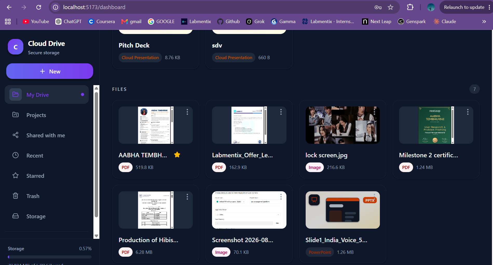

---

## 📂 Project Workspaces

Users can create dedicated **Projects** for organizing important work separately from normal folders.

Project workspaces support:

- Project creation
- Search
- List and grid views
- Starred projects
- Nested folders
- File uploads
- Drag-and-drop
- Project navigation

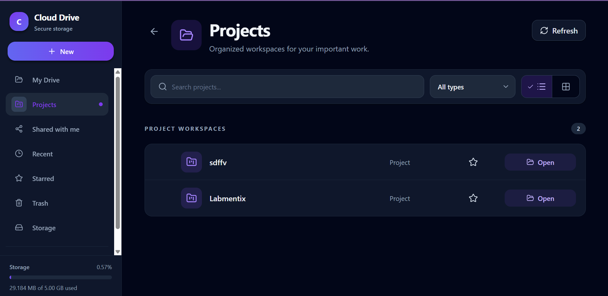

---

# 📝 Cloud-Native Editors

Cloud Drive includes built-in editors that allow users to create and modify content without uploading an external file.

## Cloud Documents

Users can create and edit cloud documents directly inside the application.

Features include:

- Editable document content
- Save functionality
- Saved-state indicator
- Character count
- Persistent cloud storage

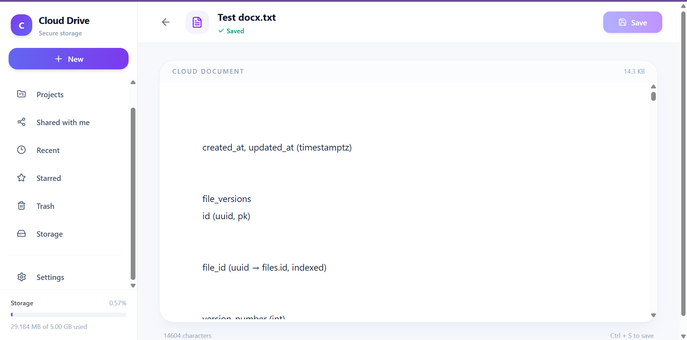

---

## 📊 Cloud Spreadsheets

Cloud Drive contains a spreadsheet editor with structured templates and formatting tools.

Features include:

- Editable cells
- Spreadsheet templates
- Font controls
- Text formatting
- Alignment
- Cell formatting
- Save functionality
- Persistent spreadsheet content

Example: Monthly Budget template.

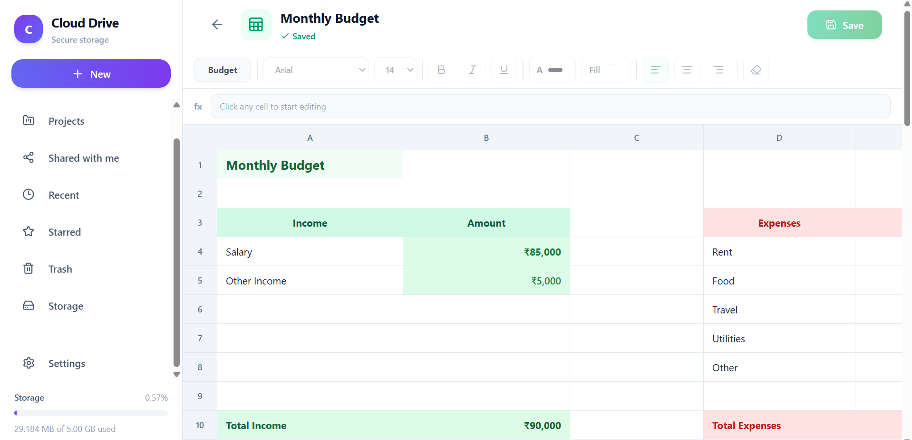

---

## 📽️ Cloud Presentations

The application also contains a built-in presentation editor.

Features include:

- Multiple slides
- Slide thumbnails
- Presentation templates
- Add text
- Editable text elements
- Resizable text boxes
- Duplicate elements
- Delete elements
- Styled presentation templates
- Persistent presentation content

Example: Pitch Deck template.

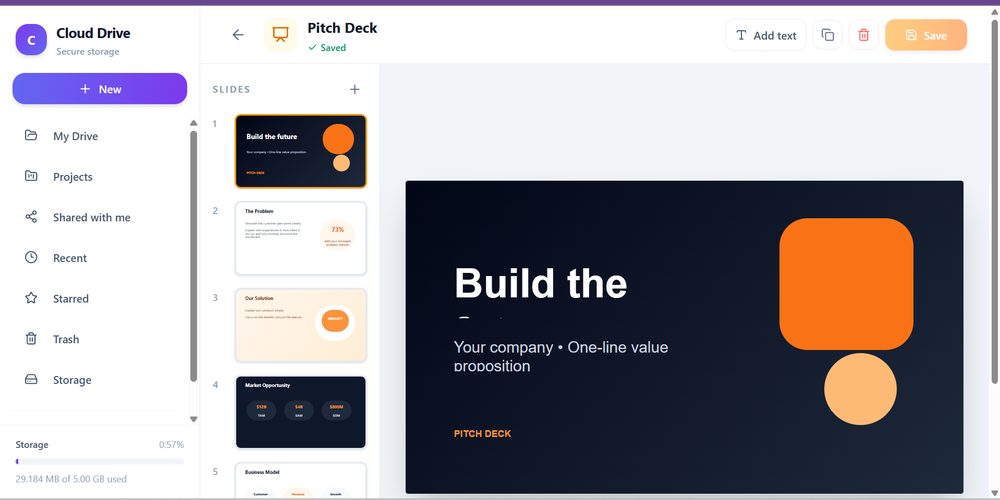

---

# 🤝 File & Folder Sharing

Cloud Drive supports sharing files and folders with other registered users.

Two permission levels are supported:

### Viewer

Users with Viewer access can view shared content but cannot modify it.

### Editor

Users with Editor access can perform permitted modifications inside shared folders.

The application also supports inherited permissions for items located inside shared folders.

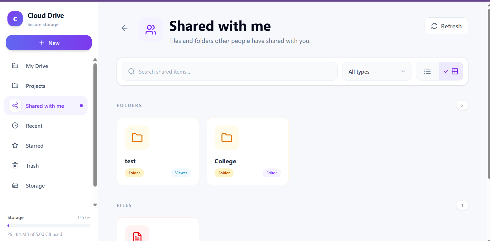

### Sharing Features

- Share files
- Share folders
- Viewer permission
- Editor permission
- Shared With Me dashboard
- Shared-folder navigation
- Inherited folder permissions
- Email notification when content is shared

---

# ✨ Gemini AI Integration

Cloud Drive integrates **Google Gemini** to provide AI-assisted file analysis.

Users can select supported content and ask Gemini questions about it.

Example capabilities include:

- Summarizing selected files
- Understanding file contents
- Asking questions about documents
- Extracting important information
- Generating contextual responses based on selected content

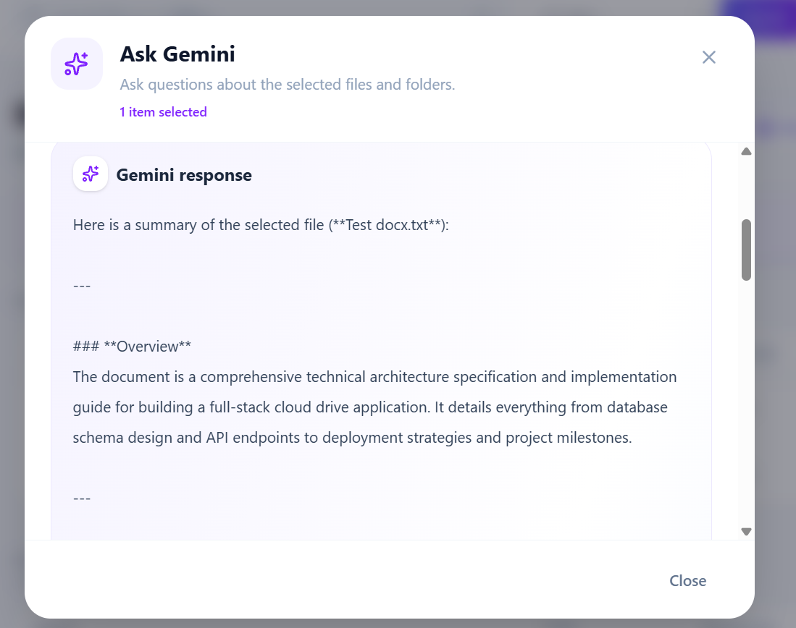

This transforms the application from only a storage system into an intelligent file-management workspace.

---

# 💾 Storage Management

Every user receives a storage quota that is tracked by the backend.

The current implementation provides a **5 GB storage quota**.

The Storage dashboard displays:

- Total storage used
- Storage available
- Percentage used
- Active-file storage
- Trash storage
- Total file count
- Storage grouped by file type
- Largest files
- Recursive folder sizes

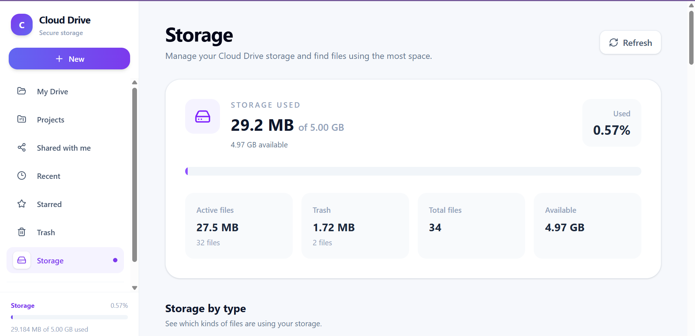

Storage quota enforcement prevents uploads that would exceed the user's available storage.

Deleted files continue to consume storage until they are permanently removed.

---

# 🗑️ Trash Management

Deleted files and folders are moved to Trash rather than immediately removed.

Users can:

- Search deleted items
- Filter deleted items
- Restore files
- Restore folders
- Permanently delete files
- Permanently delete folders
- Use grid/list views
- Select multiple deleted items
- Perform bulk operations

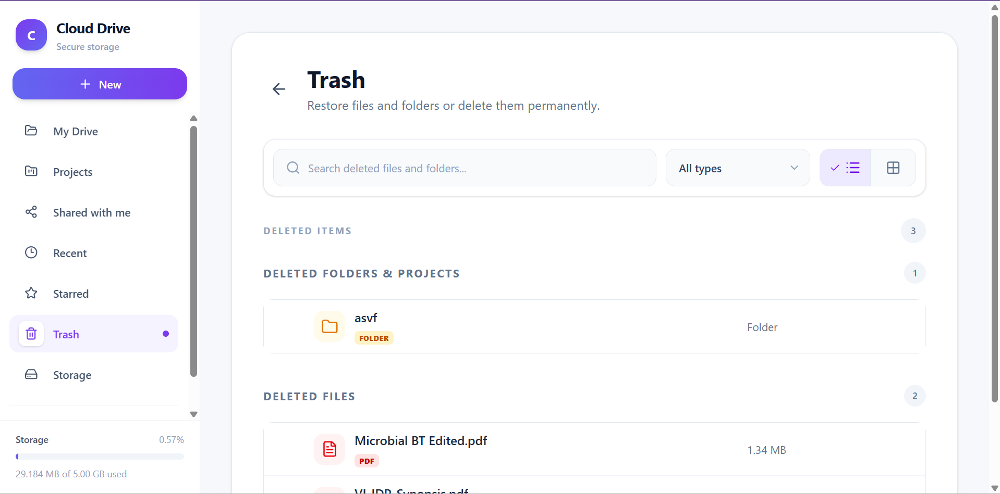

---

# ⭐ Additional Features

The application also includes:

- Starred files and folders
- Recent files
- Search and filtering
- File-type filters
- Grid and list layouts
- Multi-item selection
- Drag/marquee selection
- Bulk move
- Bulk delete
- Bulk sharing
- Bulk download
- Bulk star/unstar
- Copy links
- File details
- Folder size calculation
- Dark and light themes
- Custom appearance settings
- Responsive application interface

---

# 🛠️ Technology Stack

## Frontend

- React.js
- Vite
- JavaScript
- Tailwind CSS
- Axios
- React Router
- Lucide Icons

## Backend

- Node.js
- Express.js
- REST APIs
- JWT Authentication
- bcrypt
- Multer
- Nodemailer

## Database & Storage

- PostgreSQL
- Supabase
- Supabase Storage

## AI

- Google Gemini API

## Deployment

- Render — Frontend Static Site
- Render — Backend Web Service
- Supabase — PostgreSQL Database & Object Storage
- GitHub — Source Code & Version Control

---

# 🏗️ High-Level Architecture

```text
┌─────────────────────────────┐
│        React Frontend       │
│     Vite + Tailwind CSS     │
└──────────────┬──────────────┘
               │
               │ HTTPS / REST API
               ▼
┌─────────────────────────────┐
│     Node.js + Express API   │
│                             │
│ Authentication             │
│ Files / Folders            │
│ Sharing                    │
│ Search                     │
│ Projects                   │
│ Storage                    │
│ Gemini                     │
└──────────────┬──────────────┘
               │
        ┌──────┴──────┐
        ▼             ▼
┌──────────────┐  ┌───────────────┐
│ PostgreSQL   │  │Supabase       │
│ Database     │  │Object Storage │
└──────────────┘  └───────────────┘
        │
        ▼
┌─────────────────────────────┐
│      Google Gemini API      │
└─────────────────────────────┘
```

---

# 📡 Major API Modules

The backend is organized into REST API modules for:

```text
/api/auth
/api/files
/api/folders
/api/shares
/api/link-share
/api/starred
/api/recent
/api/search
/api/gemini
/api/storage
```

These modules separate authentication, storage, organization, sharing, AI, and file-management responsibilities.

---

# 📁 Frontend Project Structure

```text
cloud-drive-frontend/
│
├── public/
├── screenshots/
│   ├── 01-login.png
│   ├── 02-dashboard.png
│   ├── 03-drag-drop.png
│   ├── 04-upload-success.png
│   ├── 05-file-previews.png
│   ├── 06-projects.png
│   ├── 07-document-editor.png
│   ├── 08-spreadsheet-editor.png
│   ├── 09-presentation-editor.png
│   ├── 10-shared-with-me.png
│   ├── 11-gemini-ai.png
│   ├── 12-storage.png
│   └── 13-trash.png
│
├── src/
│   ├── api/
│   ├── components/
│   ├── hooks/
│   ├── pages/
│   ├── utils/
│   └── ...
│
├── .gitignore
├── package.json
├── vite.config.js
└── README.md
```

---

# ⚙️ Running the Project Locally

## 1. Clone the Frontend Repository

```bash
git clone <frontend-repository-url>
cd cloud-drive-frontend
```

## 2. Install Dependencies

```bash
npm install
```

## 3. Configure Environment Variables

Create a `.env` file in the frontend root:

```env
VITE_API_URL=http://localhost:5000/api
```

For a deployed backend, replace the value with the deployed backend API URL.

## 4. Start the Frontend

```bash
npm run dev
```

The Vite development server will start locally.

---

# ⚙️ Backend Setup

Clone the backend repository and install its dependencies:

```bash
git clone <backend-repository-url>
cd cloud-drive-backend
npm install
```

Create the required backend `.env` file.

Example structure:

```env
PORT=5000

SUPABASE_URL=your_supabase_url
SUPABASE_SECRET_KEY=your_supabase_service_key
SUPABASE_STORAGE_BUCKET=your_storage_bucket

JWT_SECRET=your_jwt_secret

GEMINI_API_KEY=your_gemini_api_key

EMAIL_USER=your_email
EMAIL_APP_PASSWORD=your_email_app_password

CLIENT_URL=http://localhost:5173

STORAGE_QUOTA_BYTES=5368709120
```

> Never commit `.env` files, API keys, JWT secrets, Supabase service keys, or email App Passwords to GitHub.

Start the backend:

```bash
npm run dev
```

---

# 🔒 Security

The application includes several security controls:

- JWT-based authentication
- Password hashing
- Protected backend routes
- Role-based sharing permissions
- Viewer/Editor authorization
- User-specific resource access
- Signed storage URLs
- File-type validation
- Storage quota enforcement
- Environment-variable-based secrets

---

# 🚀 Deployment

The application is deployed as separate frontend and backend services.

### Frontend

React/Vite production build deployed as a Render Static Site.

Build command:

```bash
npm install && npm run build
```

Publish directory:

```text
dist
```

### Backend

Node.js/Express backend deployed as a Render Web Service.

### Database & Object Storage

Supabase provides:

- PostgreSQL database
- File object storage
- Cloud storage integration

---

# 📸 Screenshots

## Authentication


## My Drive


## Drag & Drop


## Upload Confirmation


## File Previews


## Projects


## Document Editor


## Spreadsheet Editor


## Presentation Editor


## Shared With Me


## Gemini AI


## Storage


## Trash


---

# 🔮 Future Enhancements

Potential future improvements include:

- Complete file version-history interface
- Restore previous file versions
- Activity and audit history
- Resumable/chunked uploads for very large files
- Advanced upload progress management
- Expanded AI support for additional file formats
- Automated unit and integration testing
- CI/CD enhancements
- Production monitoring and observability
- Advanced security hardening

---

# 🎯 Project Objective

The objective of this project was to build a practical full-stack cloud-storage platform while implementing real-world concepts including:

- Frontend and backend integration
- REST API development
- Authentication and authorization
- Relational database design
- Cloud object storage
- File upload/download workflows
- File and folder hierarchy management
- Permission-based sharing
- AI integration
- Storage quota management
- Deployment
- Git-based version control

---

# 👩‍💻 Author

**Aabha Tembhurne**

B.E. Biotechnology  
RV College of Engineering

Developed as part of the **Labmentix Web Development Internship**.

---

## ⭐ Cloud Drive

A full-stack cloud storage, collaboration, editing and AI-assisted file-management platform.

### [Launch Live Application](https://cloud-drive-frontend-6t31.onrender.com)